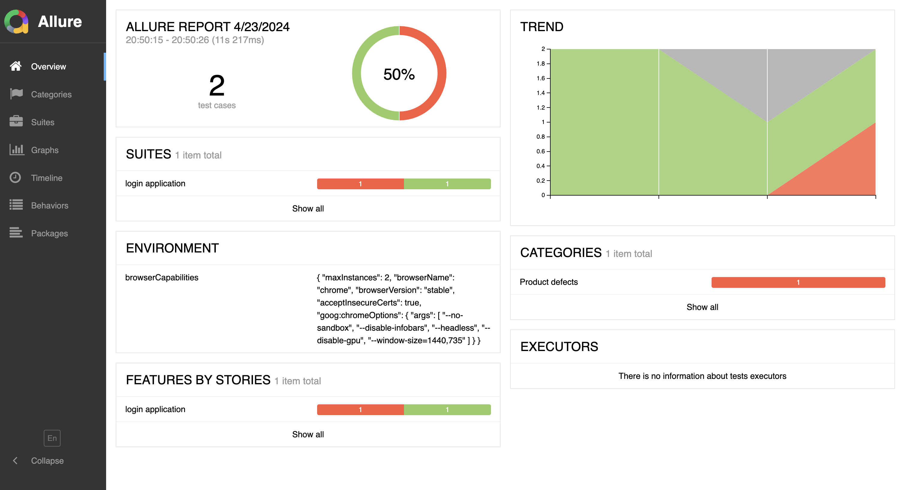
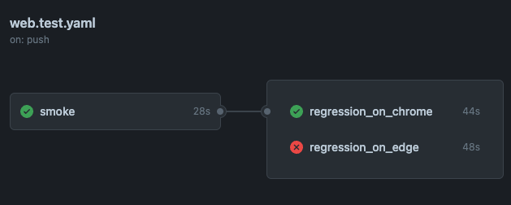
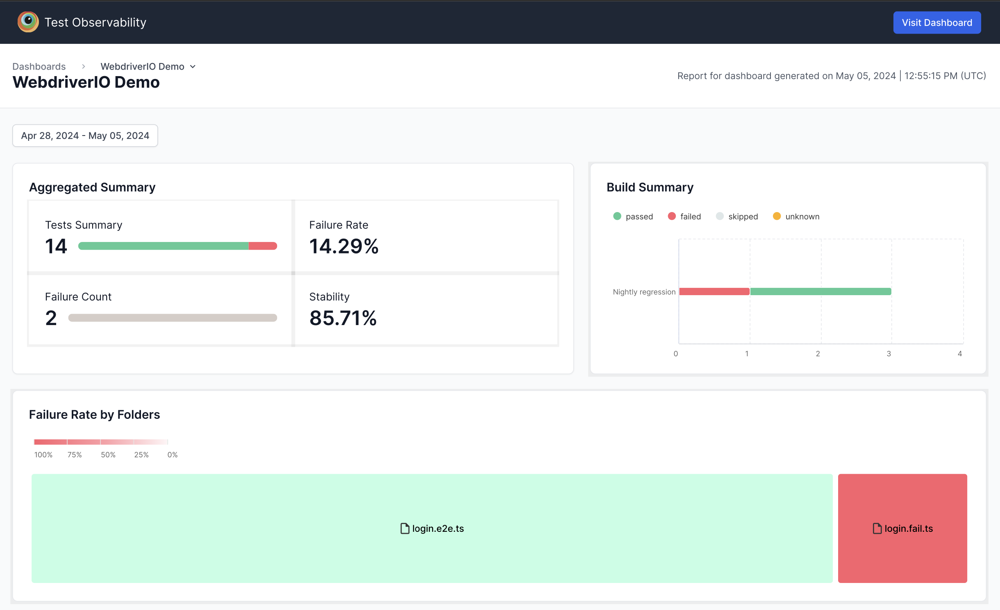
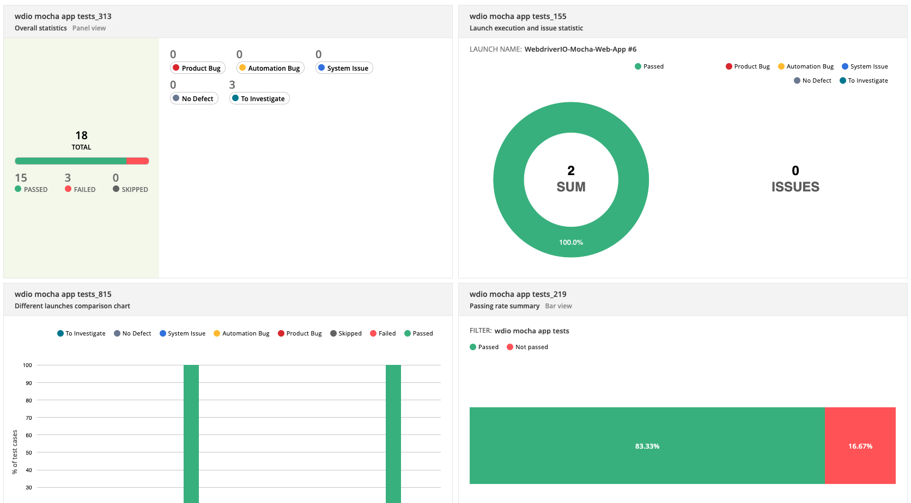

# WebdriverIO TypeScript Mocha Framework

This is a sample project that uses WebdriverIO and TypeScript. It includes examples of the PageObject pattern and some practical examples for using WebdriverIO for cross browser and parallel run. testing inside container, report portal integration.

### Requirements

[](https://nodejs.org/en/download/)
[](https://code.visualstudio.com/download)

### Getting Started

Clone Repository

```bash
git clone https://github.com/sadabnepal/webdriverio-ts-mocha.git
cd webdriverio-ts-mocha
```

Install packages:

```bash
npm install
```

Run tests:

```bash
npm run test            [ test in chrome ]
npm run test:edge       [ test in edge ]
npm run cross:browser   [ test in chrome and edge ]
```

Docker Run:

```bash
npm run docker:start    [ start the docker container ]
npm run docker:stop     [ stop the docker container ]

npm run test:docker     [ test in docker container ]

npm run docker:start:arm    [ start the docker container for mac m1 chip ]
npm run docker:stop:arm     [ stop the docker container for mac m1 chip ]
```
open http://localhost:4444/ to check if server is running

Generate report with historical data:
```bash
npm run move
npm run report
```
### Sample Report


Generate offline html report:
```bash
npm run report:html
```

Cleanup Report folder

```bash
npm run cleanup
```
### Github Action Workflow


### BrowserStack Integration
- Follow [Browser Stack Integration Getting Started](https://automate.browserstack.com/dashboard/v2/quick-start/get-started) document
- Note down `BROWSERSTACK_USERNAME` and `BROWSERSTACK_ACCESS_KEY` from profile section
- Paste value in .env for above copied content. Refer `.env.example` file
- Run `npm run test:bs` command to execute test in browser stack



### Report Portal Integration
- Setup: follow https://reportportal.io/installation
- Login: Open http://localhost:8080/ and login with time user `superadmin` and password `erebus`
- Generate API key:
    - Click on bottom left of logged in user --> click on `Profile`
    - Click on `API KEYS` --> `Generate API Key` --> copy the generated key
    - Create `.env` file in root project folder. Refer `.env.example` file
    - Paste your API key into `.env` file as `REPORT_PORTAL_KEY=<your api key>`
- Enter `REPORT_PORTAL_PROJECT=<project_assignment>` into `.env`. Value can be found on `PROJECT ASSIGNMENT` tab of user profile
- Other details are updated in `tests/config/wdio.reportPortal.ts` file
- add `REPORT_PORTAL_SWITCH=ON` to push results to report portal



### Key Features
- Custom types for web elements
- Parallel execution and Cross browser testing
- Docker for testing against/using containerization
- Github actions CI/CD integration
- Report portal integration
- BrowserStack Integration
- dotenv to store secrets locally
- eslint linting tools integrated
- husky git hooks for pre-commit checks (eslint)

### Folder Structure

```ini
├───.github
├───.husky
├───.vscode
├───images
├───tests
|    ├───config
|    ├───docker
|    ├───pages
|    ├───resources
|    ├───specs
|    ├───static
|    └───types
├───.env
├───.env.example
├───.eslintrc.js
├───.gitignore
├───docker-compose.yml
├───package-lock.json
├───package.json
├───README.md
└───tsconfig.json
```
